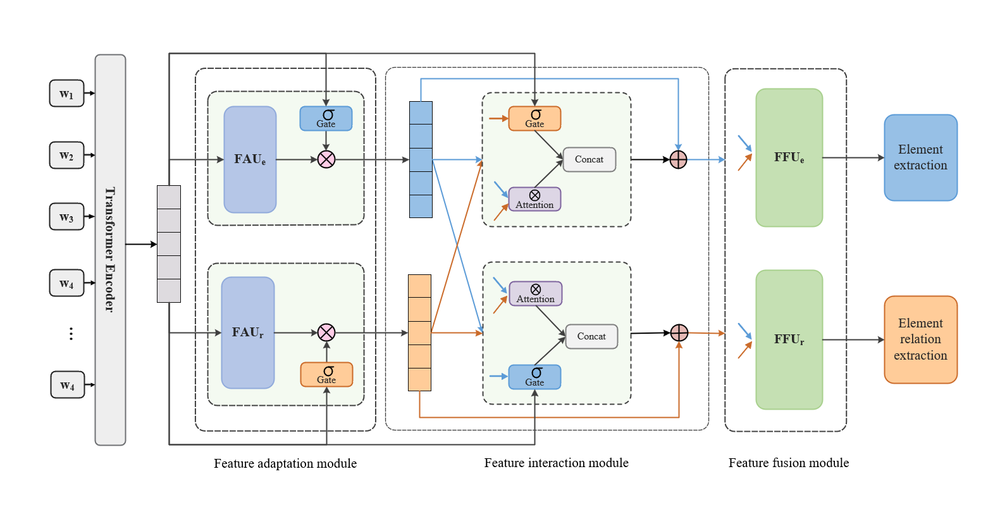

# TCRE

This repository contains codes for the paper "Task-Collaboration Representation Enhanced Joint Extraction Model for Element and Relationship"


## Model Overview


In this work, we propose a joint feature extraction model TCRE based on task collaboration representation enhancement, which focuses on capturing and utilizing specific relationships between tasks to enhance task feature representation. Compared to existing multitasking methods, TCRE exhibits better performance, confirming the effectiveness of using dependency relationships between tasks for feature extraction and feature relationship extraction in collaborative learning.


## Preparation

### Environment Setup
The experiments were performed using one single A800 GPU. The dependency packages can be installed with the command:
```
pip install -r requirements.txt
```
Other configurations we use are:  
* python == 3.8
* cuda == 11.4
* cudnn == 8.2


### Data Acquisition and Preprocessing
This is the first work that covers all the mainstream English datasets for evaluation, including **ACE05**, **ACE04**, **SCIERC**. 

Please follow the instructions of reademe.md in each dataset folder in ./data/ for data acquisition and preprocessing.  

### Model Training
The training command-line is listed below:  
```
python main.py \
--data ${ACE2005/ACE2004/SCIERC} \
--embed_mode ${albert/scibert} \
--batch_size ${12 (for ACE2005 and ACE2004) /4 (for SCIERC)} \
--lr ${1e-5} \
--output_file ${the name of your output files, e.g. ace_test} \
--eval_metric ${micro} 
```

After training, you will obtain three files in the ./save/${output_file}/ directory:     
  * **${output_file}.log** records the logging information.  
  * **${output_file}.txt** records loss, NER and RE results of dev set and test set for each epoch.  
  * **${output_file}.pt** is the saved model with best average F1 results of NER and RE in the dev set.  


### Evaluation on Pre-trained Model

The evaluation command-line is listed as follows:

```
python eval.py \
--data ${ACE2005/ACE2004/SCIERC} \
--eval_metric ${micro} \
--model_file ${the path of saved model you want to evaluate. e.g. save/ace_test.pt} \
--embed_mode ${albert/scibert}
```

## Pre-trained Models and Training Logs

### Result Display
| Dataset    |  Embedding         | Evaluation Metric | NER       | RE        | 
| ---------- |  ---------         | ----------------- | --------- | --------- |
| **ACE05**  |  Albert-xxlarge-v1 |Micro              | 90.1      | 67.4      |
| **ACE04**  |  Albert-xxlarge-v1 |Micro              | 89.8      | 63.7      |
| **SciERC** |  Scibert-uncased   |Micro              | 67.5      | 39.5      |


F1 results on ACE04:
| 5-fold     |  1    |  2  | 3   | 4     |  5      | Average |
| ---------- |  ---- |---- |---- |------ | ------- | ------- |
| Albert-NER |  90.0 |89.7 |90.4 |90.2   |  88.8   | 89.8    |
| Albert-RE  |  66.8 |62.6 |64.9 |62.7   |  61.5   | 63.7    |


## Extension on Ablation Study
As requested, we release ablation NER/RE results of 5 runs in the category of encoding scheme and decoding strategy.

| Model/seed |  ACE2005   |  SCIERC  | 
| ---------- |  --------- |--------- |
| Original   | 66.8/38.4  |66.9/36.9 |
| Sequential | 68.7/36.9  |68.0/35.9 |
| Parallel   | 67.0/35.1  |67.2/36.6 |
| Selective  | 68.1/37.4  |67.0/35.9 |

## Other
The above is our complete model and main dataset experimental code. In terms of data processing, we have referred to the paper [A Partition Filter Network for Joint Entity and Relation Extraction](https://aclanthology.org/2021.emnlp-main.17.pdf). Regarding the code for other detailed analysis experiments and expansion experiments, we will update it to this warehouse as soon as possible after optimization processing.
